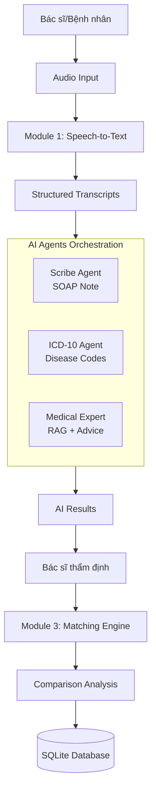

# Medical Examination Assistant (MEA)

### Tính năng chính
-  **Speech-to-Text**: Chuyển đổi giọng nói tiếng Việt sang văn bản, tự động phân biệt bác sĩ/bệnh nhân
-  **AI Agents Orchestration**: 3 agents chuyên môn (Scribe, ICD-10, Medical Expert) hoạt động song song
-  **Matching Engine**: So sánh kết quả AI vs. Bác sĩ thực tế để đánh giá độ chính xác
-  **RAG (Retrieval-Augmented Generation)**: Tra cứu phác đồ điều trị từ knowledge base

---

##  Kiến trúc hệ thống



---

### AI & Machine Learning
| Component | Technology | Model | Provider |
|-----------|-----------|-------|----------|
| **Speech-to-Text** | Whisper | whisper-large-v3 | Groq |
| **Role Detection** | LLM | openai/gpt-oss-120b | Groq |
| **Text Fixing** | LLM | openai/gpt-oss-120b | Groq |
| **Scribe Agent** | LLM | openai/gpt-oss-120b | Groq |
| **ICD-10 Agent** | LLM | openai/gpt-oss-120b | Groq |
| **Medical Expert** | LLM | openai/gpt-oss-20b | Groq |
| **Embeddings (RAG)** | Google AI | text-embedding-004 | Google |

### Agent Orchestration
- **LangGraph.js**: Multi-agent workflow orchestration
- **LangChain.js**: LLM abstractions và RAG implementation

### Database
- **SQLite**: Local file-based database
- **Drizzle ORM**: Type-safe SQL queries
- **In-Memory Vector Store**: Document retrieval cho RAG


## Module 1: Speech-to-Text (STT)

### Luồng xử lý
```
Audio Recording → Whisper STT → Role Detection → Medical Text Fixer → Clean Transcripts
```

### Chi tiết triển khai
#### 1. Audio Capture
- Browser `MediaRecorder API` với cấu hình tối ưu cho giọng nói:
  - Sample rate: 16kHz
  - Mono channel
  - Echo cancellation & Noise suppression enabled

#### 2. Transcription (Groq Whisper)
- Endpoint: `POST /api/stt`
- Model: `whisper-large-v3`
- Input: Audio blob (WebM/MP4)
- Output: Raw text + timestamps

#### 3. Speaker Role Detection
- **Phương pháp**: Context-based classification bằng LLM
- **Model**: `openai/gpt-oss-120b` (via Groq)
- **Logic**: Phân tích ngữ cảnh từng câu để xác định "Bác sĩ" hoặc "Bệnh nhân"
- **Prompt engineering**: Hướng dẫn model nhận diện dựa trên từ ngữ chuyên môn

#### 4. Medical Text Fixing
- **Model**: `openai/gpt-oss-120b`
- **Mục đích**: Sửa lỗi thuật ngữ y khoa từ STT
  - Ví dụ: "đau thượng vịt" → "đau thượng vị"
  - "viềm da dày" → "viêm dạ dày"
- **Sequential processing**: Tránh rate limits (429 errors)

## Module 2: AI Agents Orchestration

### Kiến trúc Multi-Agent
Sử dụng **LangGraph** để orchestrate 3 agents song song:

```typescript
START → Scribe Agent → ICD-10 Agent → END
              ↓
         Medical Expert → END
```

### Agent 1: Scribe Agent
- **Nhiệm vụ**: Tạo bệnh án SOAP (Subjective, Objective, Assessment, Plan)
- **Model**: `openai/gpt-oss-120b`
- **Input**: Full transcript từ STT
- **Output**: SOAP note structure
- **Prompt**: Hướng dẫn cụ thể về cấu trúc SOAP tiếng Việt

### Agent 2: ICD-10 Agent
- **Nhiệm vụ**: Gán mã bệnh ICD-10 dựa trên chẩn đoán
- **Model**: `openai/gpt-oss-120b`
- **Input**: SOAP Assessment + Subjective
- **Output**: JSON list các mã ICD-10 (format: `K29.7 - Viêm dạ dày`)
- **Response format**: `json_object` để đảm bảo structured output

### Agent 3: Medical Expert (RAG-enabled)
- **Nhiệm vụ**: Đưa ra lời khuyên y khoa dựa trên knowledge base
- **Model**: `openai/gpt-oss-20b`
- **RAG Implementation**:
  - **Vector Store**: In-memory với Google Embeddings
  - **Knowledge Base**: Markdown files (phác đồ điều trị)
  - **Retrieval**: Top-3 relevant chunks
  - **Embedding Model**: `text-embedding-004` (Google)

## Module 3: Matching Engine

### Mục đích
So sánh kết quả từ AI với quyết định lâm sàng thực tế của bác sĩ để:
- Đánh giá độ chính xác của AI
- Tạo dataset cho học máy
- Phát hiện discrepancies

### Luồng hoạt động
```
AI Results → Doctor Review Form → User Edits → Submit → Comparison Analysis → SQLite DB
```

### Thuật toán so sánh

#### 1. SOAP Semantic Matching
- **Phương pháp**: Cosine similarity trên embeddings
- **Embedding**: Google `text-embedding-004`
- **Công thức**:
  ```
  similarity = cosine(embed(ai_text), embed(doctor_text))
  score = similarity × 100  // 0-100%
  ```

#### 2. ICD-10 Code Matching
- **Phương pháp**: Exact set operations
- **Metrics**:
  - Exact matches: Codes có trong cả AI và Doctor
  - AI only: Codes chỉ AI gợi ý
  - Doctor only: Codes bác sĩ thêm vào

#### 3. Overall Match Score
```typescript
matchScore = 
  (assessment_similarity × 0.3) +
  (plan_similarity × 0.3) +
  (icd_jaccard_score × 0.3) +
  ((subjective + objective) / 2 × 0.1)
```

### Database Schema (SQLite)
```sql
CREATE TABLE comparison_records (
  id TEXT PRIMARY KEY,
  timestamp INTEGER NOT NULL,
  ai_results TEXT NOT NULL,        -- JSON
  doctor_results TEXT NOT NULL,    -- JSON
  comparison TEXT NOT NULL,        -- JSON
  match_score REAL NOT NULL,
  case_id TEXT
);
```

##  Setup & Installation


1. **Clone repository**
```bash
cd medical-examination-assistant
```

2. **Install dependencies**
```bash
npm install
```

3. **Configure environment variables**
```bash
# .env.local
GROQ_API_KEY=your_groq_api_key
GOOGLE_API_KEY=your_google_api_key
```

4. **Initialize database**
```bash
npx drizzle-kit push
```

5. **Run development server**
```bash
npm run dev
```

6. **Access application**
```
http://localhost:3000
```

---

## 📁 Project Structure

```
src/
├── app/
│   ├── page.tsx                    # Main UI
│   └── api/
│       ├── stt/route.tsx          # STT endpoint
│       ├── analyze/route.ts        # Agents endpoint
│       └── comparison/submit/route.ts  # Matching endpoint
├── components/
│   └── MatchingEngine.tsx          # Comparison UI
├── lib/
│   ├── agents/
│   │   ├── models.ts              # Centralized LLM config
│   │   ├── nodes.ts               # Agent implementations
│   │   ├── graph.ts               # LangGraph workflow
│   │   ├── state.ts               # State interface
│   │   └── comparison.ts          # Matching logic
│   ├── rag/
│   │   └── vectorStore.ts         # RAG vector DB
│   └── db/
│       ├── schema.ts              # Drizzle schema
│       └── index.ts               # DB connection
data/
├── knowledge_base/protocols/       # Medical protocols (MD)
├── vector_store/db.json           # Persisted vectors
└── db/medical_assistant.db        # SQLite database
```

---

## 🔄 Complete User Flow

1. **📝 Recording**
   - Bác sĩ bấm "Bắt đầu khám"
   - Ghi âm cuộc hội thoại
   - Bấm "Dừng & Gỡ băng"

2. **STT Processing (Module 1)**
   - Upload audio → Groq Whisper
   - Role detection (AI/Doctor classification)
   - Medical text fixing
   - Display structured transcripts

3. **AI Analysis (Module 2)**
   - Bác sĩ bấm "Phân tích chuyên sâu"
   - 3 agents chạy song song:
     - Scribe: Tạo SOAP note
     - ICD-10: Gán mã bệnh
     - Medical Expert: RAG retrieval + Advice
   - Hiển thị kết quả qua tabs

4. **Doctor Review (Module 3)**
   - Form thẩm định xuất hiện (pre-filled từ AI)
   - Bác sĩ chỉnh sửa nếu cần
   - Bấm "So sánh & Phân tích"

5. **Comparison Results**
   - Hiển thị match score (0-100%)
   - Side-by-side comparison
   - Differences highlighting
   - Lưu vào database

---

## 🔧 Key Technical Decisions

### 1. Why Groq instead of OpenAI?
- ✅ Miễn phí với quota cao (15K requests/day)
- ✅ Latency cực thấp (~6s cho 3 agents)
- ✅ Hỗ trợ tốt OpenAI-compatible models

### 2. Why LangGraph for orchestration?
- ✅ Built-in state management
- ✅ Parallel agent execution
- ✅ Easy to extend và debug

### 3. Why SQLite + Drizzle?
- ✅ Zero setup cho MVP
- ✅ Type-safe queries
- ✅ Dễ migrate lên PostgreSQL sau

### 4. Why Google Embeddings cho RAG?
- ✅ Miễn phí (không tính vào text generation quota)
- ✅ Quality cao cho tiếng Việt
- ✅ Groq không hỗ trợ embeddings API

<!-- ---

## ⚠️ Known Limitations

1. **Knowledge Base**: Hiện chỉ có 4 protocols demo (viêm dạ dày, tăng huyết áp, v.v.)
2. **Rate Limits**: Free tier có giới hạn 15K requests/day
3. **Error Handling**: Chưa có production-grade retry logic
4. **Security**: Chưa có patient data encryption -->

<!-- ---

## 🔮 Future Roadmap

### Phase 1: Data Expansion (Ngắn hạn)
- [ ] Tích hợp OpenFDA API cho drug database
- [ ] Thêm 100+ phác đồ điều trị từ Bộ Y tế
- [ ] Multi-index vector store (protocols + drugs riêng)

### Phase 2: Production Features (Trung hạn)
- [ ] User authentication (bác sĩ/admin roles)
- [ ] Patient management system
- [ ] Export PDF reports
- [ ] Analytics dashboard (AI accuracy over time)

### Phase 3: Advanced AI (Dài hạn)
- [ ] Fine-tune models dựa trên doctor feedback
- [ ] Multi-doctor consensus mode
- [ ] Automatic protocol updates
- [ ] Real-time collaboration

--- -->

